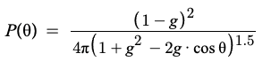

# URP_VolumetricDirectionalLight_RayMarching

- [Introduction](#Introduction)
- [Requirements](#Requirements)
- [Scattering](#Scattering)
- [Reference](#Reference)
- [Licenses](#Licenses)

## Introduction

  

Unity URP管线下实现的体积光（只支持平行光），实现思路是从屏幕空间计算世界空间坐标，然后用Ray Marching方法从每个像素向世界坐标射出一条射线，对射线上均匀采样ShadowMap，用采样的值计算散射后渲染到一张RenderTexture中，最后和相机颜色叠加。

  

DownSample : 控制遮罩RT的大小，建议2-4

Scattering Mode : Mie、Rayleigh

MaxRayDistance : RayMarching的最远距离，建议不超过阴影图的最远距离

SampleCount : 每条射线的采样次数，建议30以下

Final Intensity ：体积光颜色总强度

Extinction Mie : Mie模式下的散射系数(消光系数)

MieG : 控制Mie模式的散射方向

Extinction Rayleigh : Rayleigh模式下的散射系数(消光系数)

NoiseScale ：噪声图的缩放

NoiseIntensity : 噪声强度

Blur Offset : 模糊偏移

## Requirements

- Unity 2021.2

## Scattering

关于散射的原理，可以参考[基于物理的大气渲染](https://zhuanlan.zhihu.com/p/36498679)，此工程实现的是简化的单次散射（single scattering），只考虑单次散射。

  

如上图，假设C点为相机，CB为观察方向的一条射线，A点为光进入大气层的一点，那么对于C点看向B点的总散射光强度可以通过下面的公式计算。

 

其中I是直射光强度。β项是散射系数，有些文章称消光系数（λ是光的波长）。P项是相位函数（Phase Function），表示对于路径上的某一点P，有多少比例的光反射到相机，和cosθ有关系。D是距离，ρ表示高度h处相对于海平面处的大气密度比例，海平面处是1，对于处于地面的场景，ρ可以直接看做常数1。假设ρ恒等于1，A点的光强度是1，对于CB路径上的一点P的光强度，经过AP到达P后衰减成exp{-β(λ)*D(AP)}* β(λ)，再经过PC后到达C衰减成exp{-β(λ){(D(AP)+D(PC)} *P(θ)*β(λ)，对路径CB上的每一点做积分就可以得到最终结果，RayMarching多次采样并相加就是对应积分。对于平行光来说，一条路径上每个点P和入射光的夹角θ都是一样的，所以可以把P项提到积分外面。

简化的计算：β项看作一个系数，对于地面场景，ρ项看成1，把每个P点接受到的光看作相等，去掉D(AP)。

   

散射模型一般又分为两类，Mie Scattering和Rayleigh，在计算中这两个模型的相位函数不一样，分别对应下图两个公式：

Mie : g是偏心率，控制散射的形状，负值会使光大部分沿着正方向散射，正值相反，等于0的时候各方向均匀。

   

Rayleigh : 

  

最后有个和上面理论不太一样的地方，这个散射系数β有两处，一个是后面的积分里面，一个是前面的总散射系数。β越大，后面的积分越小，但前面的总系数越大，这样最后的强度调整就非常不直观，所以我参考了[SlightlyMad/VolumetricLights](https://github.com/SlightlyMad/VolumetricLights)的做法，把前面的散射系数β换成了一个用于控制总强度的系数。

## Reference

https://zhuanlan.zhihu.com/p/36498679

https://www.alanzucconi.com/2017/10/10/atmospheric-scattering-1/

https://github.com/SlightlyMad/VolumetricLights

http://developer.amd.com/wordpress/media/2012/10/ATI-LightScattering.pdf

## Licenses

MIT

